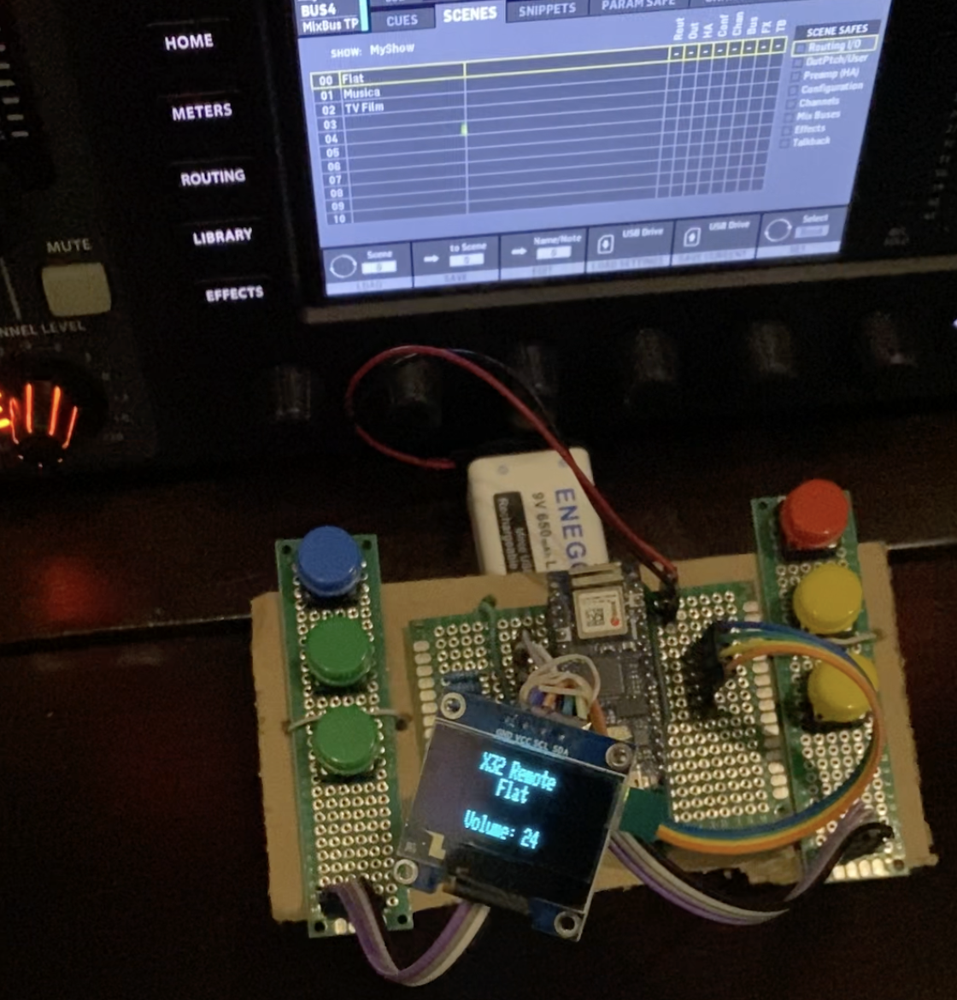

# X32 Remote

Description
-----
This project use the Open Sound Control to manage a Behringer X32 remotely.

It's developed to work with WiFi or Ethernet depending on the hardware used.

The goal is to have a remote that can modify the volume of the selected DCA, mute it or change the preset (scene).

Hardware
-----
This project run on:

 - Arduino NANO 33 IoT (WiFi mode)

 - Arduino Uno with network shield (Ethernet mode)
 

There are six buttons: 

 - Resume (PIN 2)
 - Volume Up (PIN 3)
 - Volume Down (PIN 4)
 - Mute (PIN 5)
 - Scene Next (PIN 6)
 - Scene Prev (PIN 7)
 
 
Oled monitor to display information
 

Software
-----
There are some variables that should be set:

 - __DEBUG_SERIAL, if defined it enables serial debug messages
 - __USE_WIFI, define it for WiFi mode (Arduino NANO 33 IoT) or comment it for Ethernet mode (Arduino Uno with network shield)

 - ssid (set WiFi SSID in case of WiFi mode)
 - pass (set WiFi password in case of WiFi mode)

 - outIp (set the ip of your X32 Mixer)

 - sceneMin (set to 0, mandatory)
 - sceneMax (set the max number of scenes that remote can select)
 - sceneDesc (Not mandatory, you can specify a description for the first N scenes)

Dependencies
-----
This project requires these libraries to manage OLED monitor and OSC communication:

 - Open Sound Control (OSC) by Adrian Freed ([https://github.com/CNMAT/OSC](https://github.com/CNMAT/OSC))

 - Adafruit GFX Library by Adafruit ([https://github.com/adafruit/Adafruit-GFX-Library](https://github.com/adafruit/Adafruit-GFX-Library))

 - Adafruit SSD1306 by Adafruit ([https://github.com/adafruit/Adafruit_SSD1306](https://github.com/adafruit/Adafruit_SSD1306))
